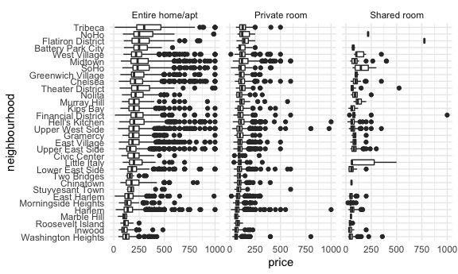

Case Study
================
Heidi Lumish

## Load a dataset

``` r
nyc_airbnb = read_csv("./data/nyc_airbnb.csv") %>% 
  janitor::clean_names() 
```

    ## Rows: 40753 Columns: 17

    ## ── Column specification ────────────────────────────────────────────────────────
    ## Delimiter: ","
    ## chr   (5): name, host_name, neighbourhood_group, neighbourhood, room_type
    ## dbl  (11): id, review_scores_location, host_id, lat, long, price, minimum_ni...
    ## date  (1): last_review

    ## 
    ## ℹ Use `spec()` to retrieve the full column specification for this data.
    ## ℹ Specify the column types or set `show_col_types = FALSE` to quiet this message.

``` r
str(nyc_airbnb)
```

    ## spec_tbl_df [40,753 × 17] (S3: spec_tbl_df/tbl_df/tbl/data.frame)
    ##  $ id                            : num [1:40753] 7949480 16042478 1886820 6627449 5557381 ...
    ##  $ review_scores_location        : num [1:40753] 10 NA NA 10 10 10 10 9 10 9 ...
    ##  $ name                          : chr [1:40753] "City Island Sanctuary relaxing BR & Bath w Parking" "WATERFRONT STUDIO APARTMENT" "Quaint City Island Community." "Large 1 BDRM in Great location" ...
    ##  $ host_id                       : num [1:40753] 119445 9117975 9815788 13886510 28811542 ...
    ##  $ host_name                     : chr [1:40753] "Linda & Didier" "Collins" "Steve" "Arlene" ...
    ##  $ neighbourhood_group           : chr [1:40753] "Bronx" "Bronx" "Bronx" "Bronx" ...
    ##  $ neighbourhood                 : chr [1:40753] "City Island" "City Island" "City Island" "City Island" ...
    ##  $ lat                           : num [1:40753] -73.8 -73.8 -73.8 -73.8 -73.8 ...
    ##  $ long                          : num [1:40753] 40.9 40.9 40.8 40.8 40.9 ...
    ##  $ room_type                     : chr [1:40753] "Private room" "Private room" "Entire home/apt" "Entire home/apt" ...
    ##  $ price                         : num [1:40753] 99 200 300 125 69 125 85 39 95 125 ...
    ##  $ minimum_nights                : num [1:40753] 1 7 7 3 3 2 1 2 3 2 ...
    ##  $ number_of_reviews             : num [1:40753] 25 0 0 12 86 41 74 114 5 206 ...
    ##  $ last_review                   : Date[1:40753], format: "2017-04-23" NA ...
    ##  $ reviews_per_month             : num [1:40753] 1.59 NA NA 0.54 3.63 2.48 5.43 2.06 5 2.98 ...
    ##  $ calculated_host_listings_count: num [1:40753] 1 1 1 1 1 1 1 4 3 4 ...
    ##  $ availability_365              : num [1:40753] 170 180 365 335 352 129 306 306 144 106 ...
    ##  - attr(*, "spec")=
    ##   .. cols(
    ##   ..   id = col_double(),
    ##   ..   review_scores_location = col_double(),
    ##   ..   name = col_character(),
    ##   ..   host_id = col_double(),
    ##   ..   host_name = col_character(),
    ##   ..   neighbourhood_group = col_character(),
    ##   ..   neighbourhood = col_character(),
    ##   ..   lat = col_double(),
    ##   ..   long = col_double(),
    ##   ..   room_type = col_character(),
    ##   ..   price = col_double(),
    ##   ..   minimum_nights = col_double(),
    ##   ..   number_of_reviews = col_double(),
    ##   ..   last_review = col_date(format = ""),
    ##   ..   reviews_per_month = col_double(),
    ##   ..   calculated_host_listings_count = col_double(),
    ##   ..   availability_365 = col_double()
    ##   .. )
    ##  - attr(*, "problems")=<externalptr>

``` r
nyc_airbnb =
  nyc_airbnb %>% 
  mutate(stars = review_scores_location / 2) %>% 
  rename(borough = neighbourhood_group)
```

Let’s try to count things:

\*How many rentals are there? Of what type? In what places? These are
two ways to make the same table

``` r
nyc_airbnb %>% 
  janitor::tabyl(borough, room_type)
```

    ##        borough Entire home/apt Private room Shared room
    ##          Bronx             192          429          28
    ##       Brooklyn            7427         9000         383
    ##      Manhattan           10814         7812         586
    ##         Queens            1388         2241         192
    ##  Staten Island             116          144           1

``` r
nyc_airbnb %>% 
  count(borough, room_type) %>% 
  pivot_wider(
    names_from = room_type,
    values_from = n)
```

    ## # A tibble: 5 × 4
    ##   borough       `Entire home/apt` `Private room` `Shared room`
    ##   <chr>                     <int>          <int>         <int>
    ## 1 Bronx                       192            429            28
    ## 2 Brooklyn                   7427           9000           383
    ## 3 Manhattan                 10814           7812           586
    ## 4 Queens                     1388           2241           192
    ## 5 Staten Island               116            144             1

*Is price correlated with review score? *Is price correlated with room
type?

``` r
nyc_airbnb %>% 
  ggplot(aes(x = stars, y = price)) +
  geom_point() + 
  facet_grid(. ~ room_type)
```

    ## Warning: Removed 10037 rows containing missing values (geom_point).


\*Price and neighborhood

coord\_flip switches x and y axes

``` r
nyc_airbnb %>% 
  filter(borough == "Manhattan") %>% 
  group_by(neighbourhood) %>% 
  summarize(mean_price = mean(price, na.rm = TRUE)) %>% arrange(mean_price) %>% view

nyc_airbnb %>% 
  filter(borough == "Manhattan",
         price <= 1000) %>% 
  ggplot(aes(x = neighbourhood, y = price)) +
  geom_boxplot() +
  coord_flip()
```


``` r
nyc_airbnb %>% 
  filter(borough == "Manhattan",
         price <= 1000) %>% 
  mutate(neighbourhood = fct_reorder(neighbourhood, price)) %>% 
  ggplot(aes(x = neighbourhood, y = price)) +
  geom_boxplot() +
  coord_flip()
```


``` r
nyc_airbnb %>% 
  filter(borough == "Manhattan",
         price <= 1000) %>% 
  mutate(neighbourhood = fct_reorder(neighbourhood, price)) %>% 
  ggplot(aes(x = neighbourhood, y = price)) +
  geom_boxplot() +
  coord_flip() +
  facet_grid(. ~ room_type)
```



Price vs. location Sample 5000 to make it easier to run Resulting plot
looks like a map of nyc

``` r
nyc_airbnb %>% 
  filter(price <500) %>% 
  sample_n(5000) %>% 
  ggplot(aes(x = lat, y = long, color = price)) +
  geom_point(alpha = .5)
```


## Retry leaflet for making maps

``` r
nyc_airbnb %>% 
  sample_n(5000) %>% 
  leaflet() %>% 
  addTiles() %>% 
  addMarkers(~lat, ~long)
```
